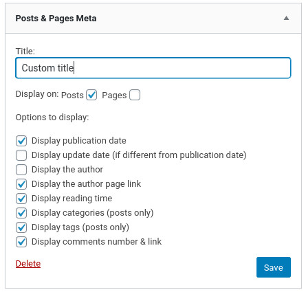
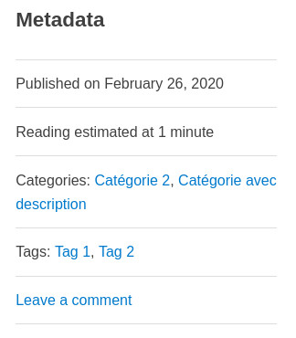

# Minimalist-Posts-Pages-Meta

This WordPress plugin create a widget to display posts & pages metadata as widget.

## Description

Instead of displaying the metadata at the bottom of your post or under the title, this WordPress plugin can display them in your sidebar as a widget. It can be displayed on all posts & pages or only on one of them.

## Installation

### Composer installation

You can use composer to install this plugin as a dependency:

```
{
"require": {
    "armandphilippot/minimalist-posts-pages-meta": "dev-master"
}
"repositories": [{
    "type": "git",
    "url": "git@github.com:ArmandPhilippot/minimalist-posts-pages-meta.git"
}]
```

### Manuel installation

You can download this plugin on Github, then extract it in `/wp-content/plugins/` directory.

## Utilisation

1. Navigate to the "Plugins" dashboard page and click on "Activate".
2. Add "Posts & Pages Meta" to a widget area through the 'Widgets' menu in WordPress.
3. Configure settings.

## Screenshots

  

This plugin contains no style. These screenshots show you some possibilities suited to a theme.

## Changelog

### 1.0

-   Stable version

## License

The Minimalist-Posts-Pages-Meta plugin is licensed under the GPL v2 or later. A copy of the license is included in the root of the plugin’s directory. The file is named LICENSE.
